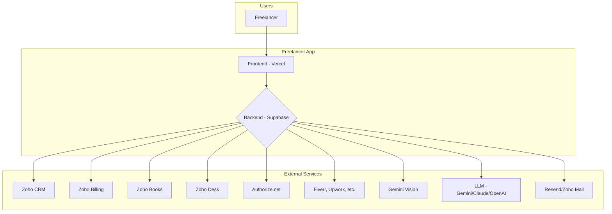
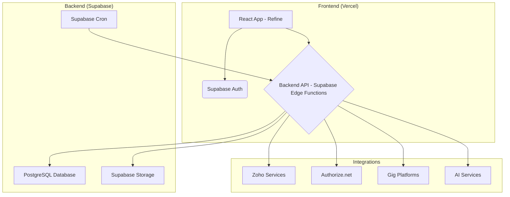
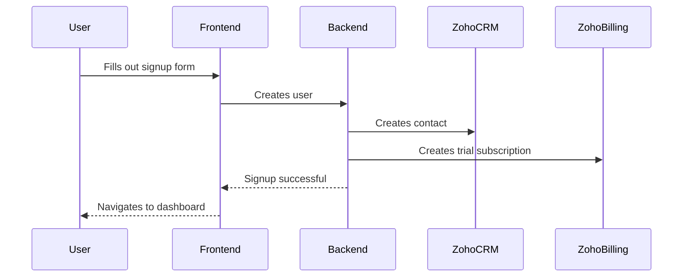
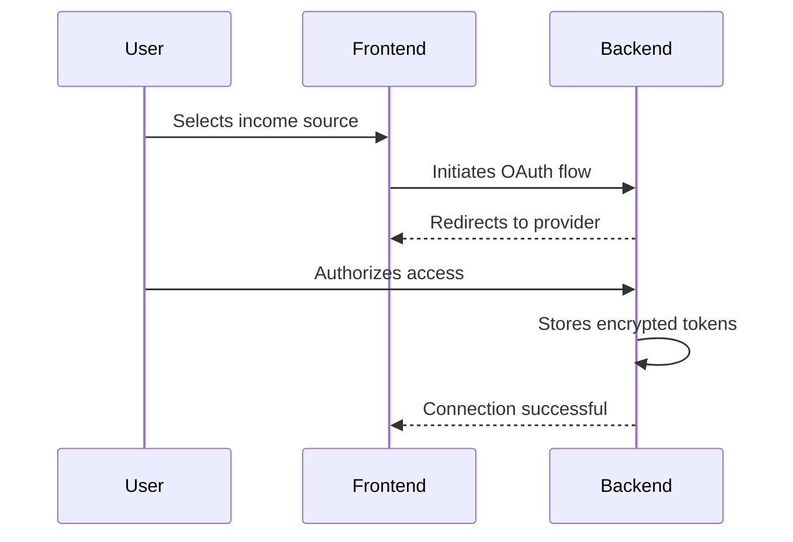
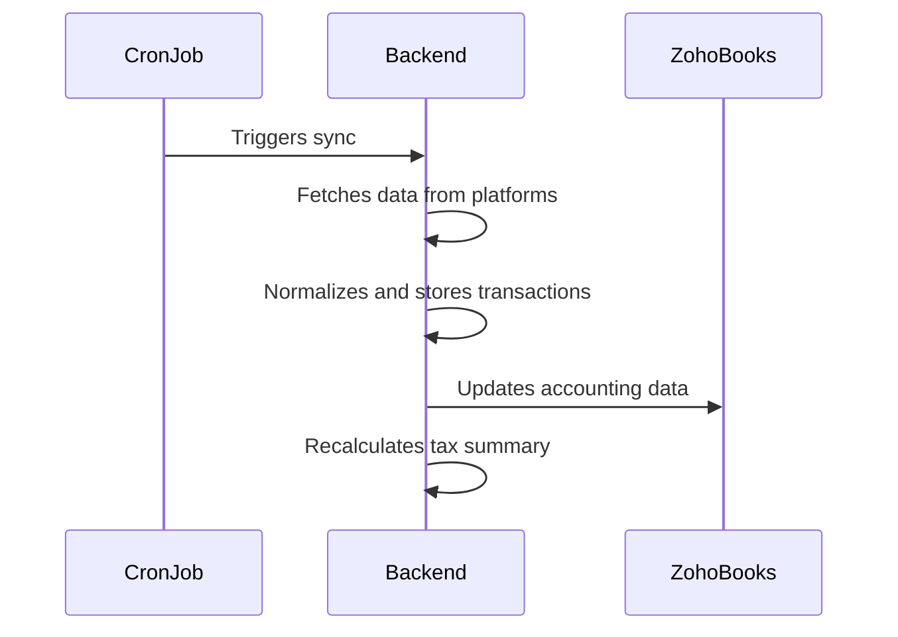
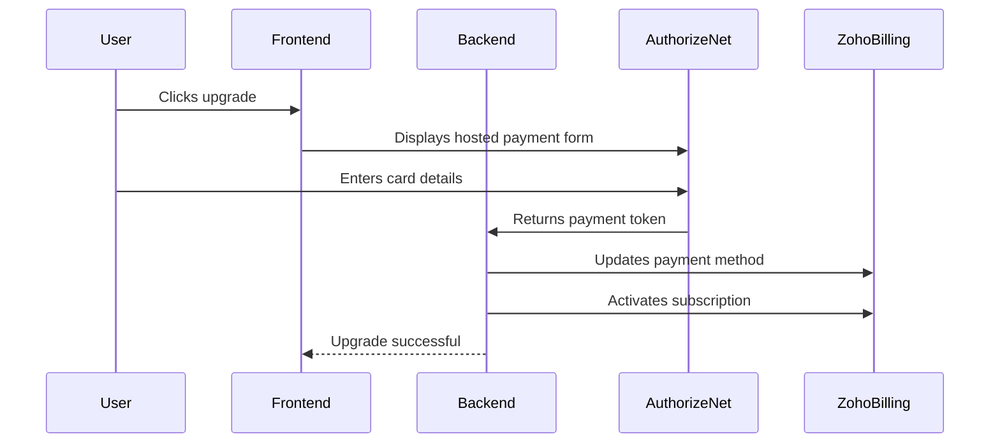
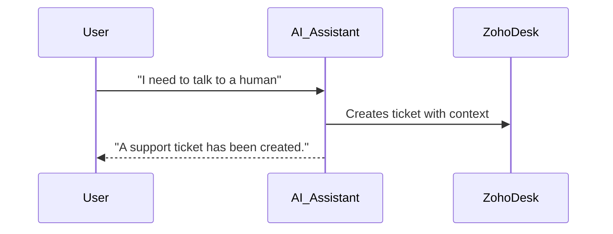

# Architecture

This document outlines the architecture of the Freelancer Invoicing & Gig Income Tracking application. It covers the system context, components, data flows, and key design decisions.

## 1. System Context Diagram

This diagram shows the overall system landscape and how the application interacts with external systems and users.

## 2. Component Diagram

This diagram breaks down the system into its core components and their relationships.

## 3. Data Flow Diagrams

These diagrams illustrate the sequence of operations for key user flows.

### a) Signup & Trial

### b) Connect Income Source

### c) Scheduled Sync

### d) Billing Upgrade

### e) AI Support Escalation

## 4. Environment Separation

The application will have three environments: `dev`, `staging`, and `prod`. Each environment will have its own separate Supabase project, Vercel project, and API keys. This ensures that development and testing activities do not impact the production environment.

## 5. Key Design Decisions

- **Zoho as System of Record:** Zoho will be the single source of truth for all customer-related data, including CRM, billing, and support. However, the user interface for these functions will be built into our platform to provide a seamless user experience.
- **Authorize.net for Payments:** We will use Authorize.net for payment processing, leveraging their hosted payment forms to minimize our PCI-DSS scope. The primary integration path will be through Zoho Billing, with a direct integration as a fallback option if needed.
- **AI-First Support:** The primary support channel will be an in-app AI assistant, with human support available as an escalation path.
