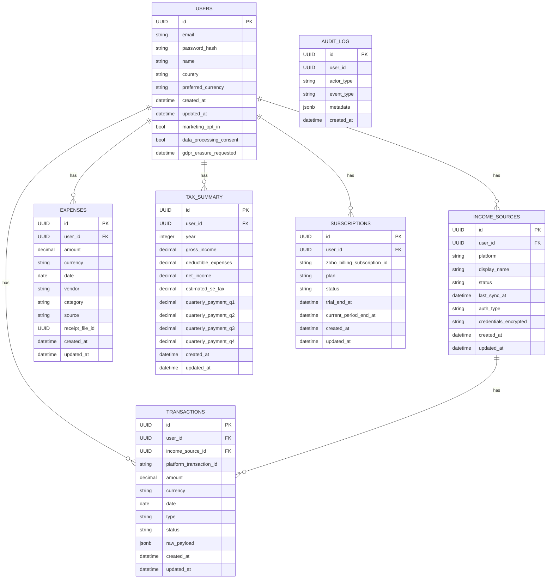

# Data Model

This document defines the data model for the Freelancer Invoicing & Gig Income Tracking application. It includes an Entity-Relationship Diagram (ERD) and detailed schemas for each table in the PostgreSQL database.

## 1. Entity-Relationship Diagram (ERD)



## 2. Table Schemas

### `users`

| Column | Type | Constraints | Description |
| --- | --- | --- | --- |
| `id` | `uuid` | Primary Key | Unique identifier for the user. |
| `email` | `text` | Not Null, Unique | User's email address. |
| `password_hash` | `text` | Not Null | Hashed password (managed by Supabase Auth). |
| `name` | `text` | | User's full name. |
| `country` | `text` | | User's country of residence. |
| `preferred_currency` | `text` | | User's preferred currency for display. |
| `created_at` | `timestamp` | Not Null | Timestamp of when the user was created. |
| `updated_at` | `timestamp` | Not Null | Timestamp of when the user was last updated. |
| `marketing_opt_in` | `boolean` | | Whether the user has opted into marketing communications. |
| `data_processing_consent` | `boolean` | | Whether the user has consented to data processing. |
| `gdpr_erasure_requested` | `timestamp` | | Timestamp of when the user requested erasure under GDPR. |

### `income_sources`

| Column | Type | Constraints | Description |
| --- | --- | --- | --- |
| `id` | `uuid` | Primary Key | Unique identifier for the income source. |
| `user_id` | `uuid` | Foreign Key (users.id) | The user who owns this income source. |
| `platform` | `text` | | The platform the income is from (e.g., 'FIVERR', 'UPWORK'). |
| `display_name` | `text` | | A user-friendly name for the income source. |
| `status` | `text` | | The status of the connection ('CONNECTED', 'ERROR', 'DISCONNECTED'). |
| `last_sync_at` | `timestamp` | | Timestamp of the last successful sync. |
| `auth_type` | `text` | | The authentication type ('OAUTH', 'API_KEY', 'MANUAL'). |
| `credentials_encrypted` | `text` | | Encrypted credentials for the income source. |
| `created_at` | `timestamp` | Not Null | Timestamp of when the income source was created. |
| `updated_at` | `timestamp` | Not Null | Timestamp of when the income source was last updated. |

... (and so on for the other tables)

## 3. Multi-Tenancy Approach

The database will be multi-tenant, with each user's data isolated from other users. This will be enforced using PostgreSQL's Row-Level Security (RLS) feature.

## 4. Row-Level Security (RLS) Policies

All tables containing user data will have RLS policies enabled. The policies will ensure that users can only access their own data.

**Example RLS Policy for the `transactions` table:**

```sql
CREATE POLICY "Enable read access for users based on user_id" ON "transactions" FOR SELECT USING (auth.uid() = user_id);
```

## 5. Audit Logging Standards

All significant events in the system will be logged in the `audit_log` table. This includes user actions, system events, and support agent actions. The `metadata` column will be used to store relevant data about the event, with care taken to minimize the inclusion of personally identifiable information (PII).

## 6. External ID Mapping

To maintain consistency with external systems, we will store their IDs in our database.

| External System | Our Table | Our Column |
| --- | --- | --- |
| Zoho CRM | `users` | `zoho_crm_contact_id` |
| Zoho Billing | `subscriptions` | `zoho_billing_subscription_id` |
| Zoho Desk | `audit_log` | `zoho_desk_ticket_id` (in metadata) |
| Authorize.net | `users` | `authorize_net_customer_profile_id` |

## 7. CRM Tagging History

Changes to Zoho CRM tags will be tracked in the `audit_log` table. This will allow us to maintain a history of how a customer's segmentation has changed over time.
